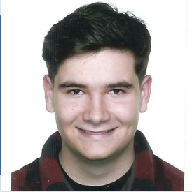

<table style="border: none; width: 100%;">
  <tr>
    <td width="270" style="vertical-align: top; padding-right: 20px; border: none;">
      
    </td>
    <td style="vertical-align: top; border: none;">
      <h1>¡Hola! Soy Lander 👋</h1>
      > Soy un estudiante de Inteligencia Artificial y Big Data con una gran pasión por la informática. Me considero una persona responsable y trabajadora. 
       > Busco activamente oportunidades para seguir aprendiendo y aplicando mis habilidades en un entorno profesional.
    </td>
  </tr>
</table>

<h2 style="margin-top: 30px;">📬 Contacto</h2>

  <strong>Email:</strong> <a href="mailto:landerroz05@gmail.com" style="color: #ffffffff; text-decoration: none; font-weight: 500;">landerroz05@gmail.com</a>
  <strong>GitHub:</strong> <a href="https://github.com/lander-ortuzar" target="_blank" style="color: #ffffffff; text-decoration: none; font-weight: 500;">github.com/lander-ortuzar</a>
  <strong>Teléfono:</strong> 688 60 57 30
  <strong>Localidad:</strong> Portugalete

  <a href="assets/CV_Lander-Ortuzar.pdf" download
     style="background: #0073e6; color: white; padding: 12px 25px; border-radius: 10px; text-decoration: none; font-weight: 700; font-size: 18px; box-shadow: 0 3px 10px rgba(0,0,0,0.15); transition: background 0.2s ease;">
    📄 Descargar CV
  </a>

